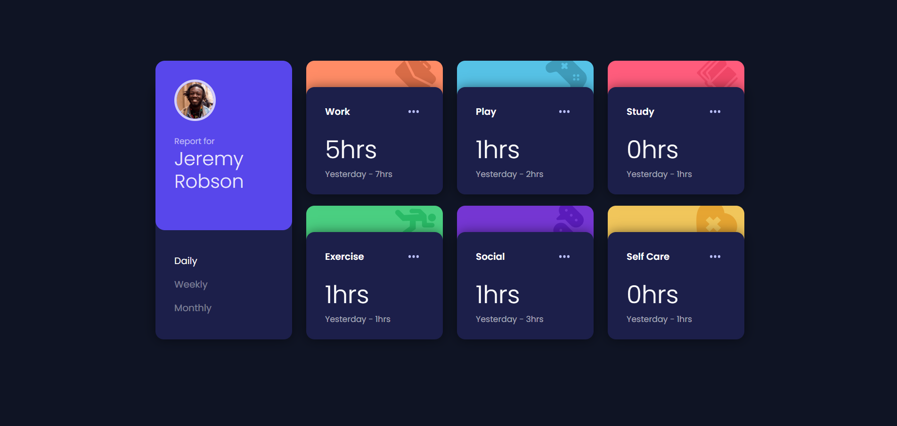

# Frontend Mentor - Time tracking dashboard solution

This is a solution to the [Time tracking dashboard challenge on Frontend Mentor](https://www.frontendmentor.io/challenges/time-tracking-dashboard-UIQ7167Jw). Frontend Mentor challenges help you improve your coding skills by building realistic projects. 

## Table of contents

- [Overview](#overview)
  - [The challenge](#the-challenge)
  - [Screenshot](#screenshot)
  - [Links](#links)
- [My process](#my-process)
  - [Built with](#built-with)
  - [What I learned](#what-i-learned)
- [Author](#author)

## Overview

### The challenge

Users should be able to:

- View the optimal layout for the site depending on their device's screen size
- See hover states for all interactive elements on the page
- Switch between viewing Daily, Weekly, and Monthly stats

### Screenshot

### Links

- Live Site URL: [https://frontend-mentor-time-tracking-dashb-one.vercel.app/](https://frontend-mentor-time-tracking-dashb-one.vercel.app/)

## My process

### Built with

- Semantic HTML5 markup
- CSS custom properties
- Flexbox
- CSS Grid
- Mobile-first workflow

### What I learned
I learned js better while doing solving this challenge.

## Author

- Website - [Robiul Islam Sagar](https://robiulportfolio.vercel.app/)
- Frontend Mentor - [@robiulsagor](https://www.frontendmentor.io/profile/robiulsagor)
- LinkedIn - [@robiul](https://www.linkedin.com/in/robiul-islam-sagar-356582226/)